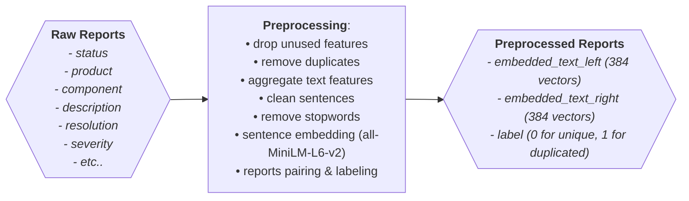
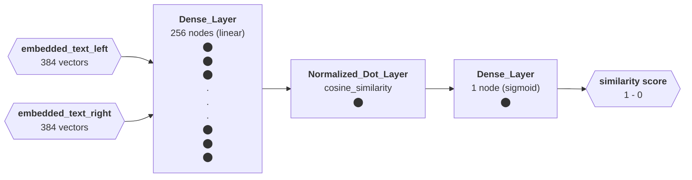

# Bug Report Recommendation System [BuggyBuddy]

BuggyBuddy is an end-to-end data science project aimed at detecting duplicated bug reports and providing recommendations to users for similar bug reports, thereby facilitating faster problem resolution in software development.

## Data Sources

This project utilizes Firefox bug report data sourced via [Bugzilla API](). The dataset comprises structured information such as bug `id`, `duplicates`, `summary`, `description`, `status`, `resolution`, `platform`, `product`, `type`, `priority`, `severity`, `component`.

## Data Preprocessing

Before the raw report data is used for model training, data preprocessing is performed as depicted in the diagram below. Several relevant features in the Raw Report are aggregated into a text feature, which then undergoes cleaning and stop word removal processes.

The cleaned text data is then embedded using the pretrained model `all-MiniLM-L6-v2`, resulting in 384-dimensional vectors. From this data, text pairs are formed and labeled `"1"` if the text pair is the same/duplicate, while `"0"` if the text pair is unique.

## Models Used

The model used is a Siamese network trained to detect whether two texts are the same (duplicate) or not. The model takes two inputs (embedded text) which are then transformed using a dense/fully connected layer (256 nodes) to produce a vector. The similarity of the vectors is then calculated, and finally, a single dense node with sigmoid activation is used for binary classification.

When used for embedding, only the first layer (fully connected) is utilized to produce the vector, which can then be used for similarity search.

## Code Structure

The BuggyBuddy project is organized as follows:

- `data/`: Contains raw data (fetched from API) and cached data (created during preprocessing).
- `models/`: Includes trained models.
- `bug_classification.ipynb`: Jupyter notebook for data exploration, model training, and evaluation.
- `requirements.txt`: List of dependencies for easy installation.

## Findings and Results

**Duplicate Bug Detection:**

- Successfully created duplicated bug reports with the following metric scores:
  - Precision: 0.995
  - Recall: 1.000

**Similarity Search:**

- Utilizing [FAISS](https://github.com/facebookresearch/faiss) for testing the performance of similarity search, successfully provided recommendations for similar bug reports with a recall@10 of 0.3301.
